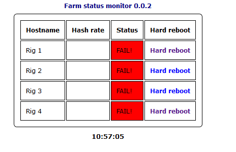

# Remote-rig-restarting
A way to restart your frozen rigs remotely

This bunch of scripts are written for the Raspberry PI 2 / 3.  The idea is to controll GPIO channells that controll relays that short the power button pins on your rigs motherboards.  The script makes the frozen rig think that the power button is pressed for 6 seconds, released for 10 sec and pressed again for one sec, thus rebootting a rig that has frozen.  The PHP script acts as a front end for this, it allso shows the total hashrate of the rigs (Claymore miners only).  For the PHP to work you need to run some sort of a webserver on your pi.  The www user allso needs sufficient rights to be able to execute python scripts.

Usage:

Put the html and php files in your /var/www/html (or what ever www folder you might have) and the .sh file in your script folder.

Edit the body.php on line 13, input the path to your script folder.
Edit the body.php on line 18-21, input your rigs ip adresses.

Connect the GPIO pins to some relays and connect the relays to short the power button on the motherboards.
By default the controlling pins are 32, 35, 36, 40 by board pin numbering

